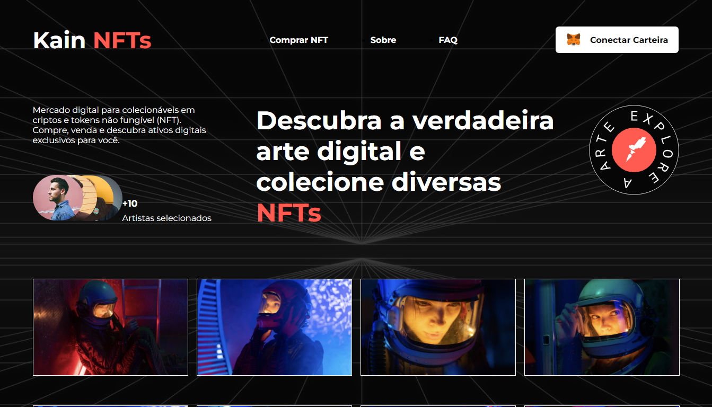
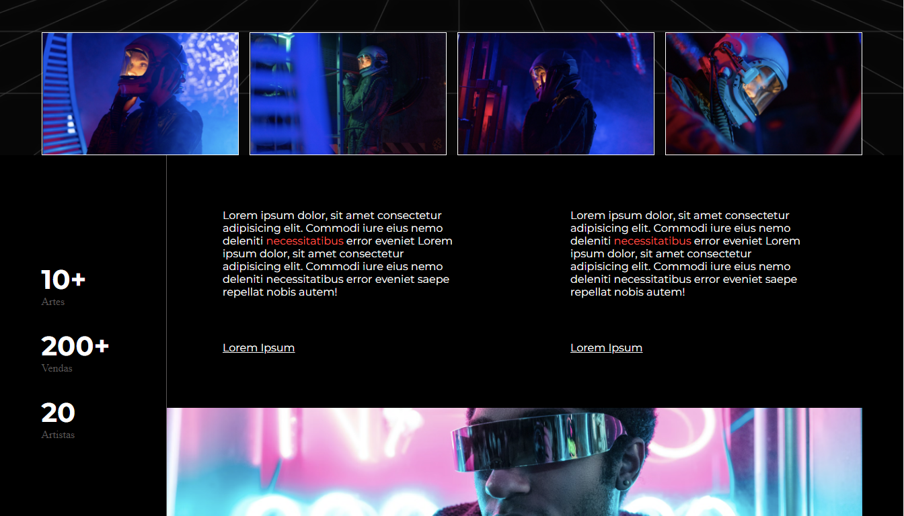
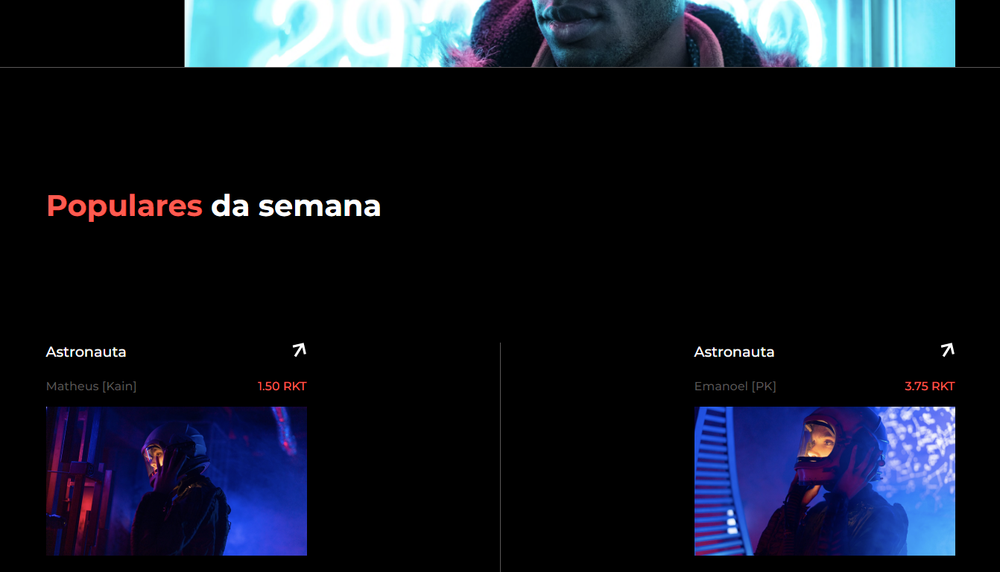
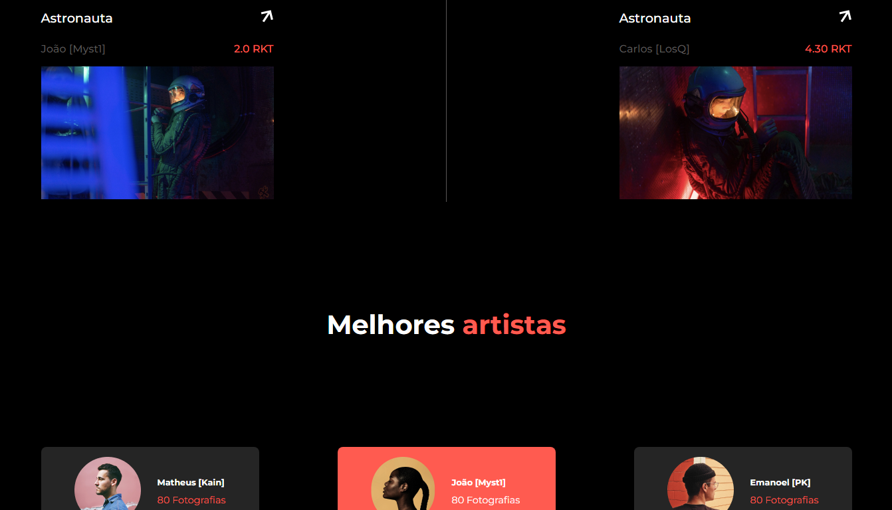
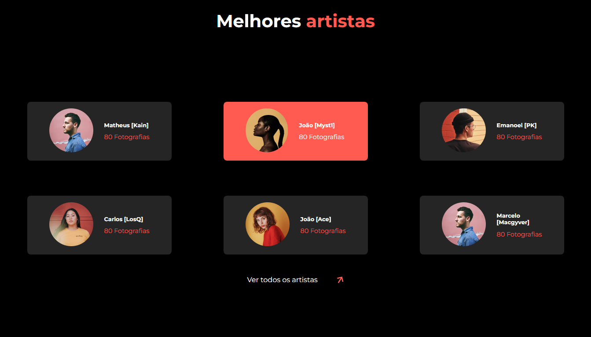
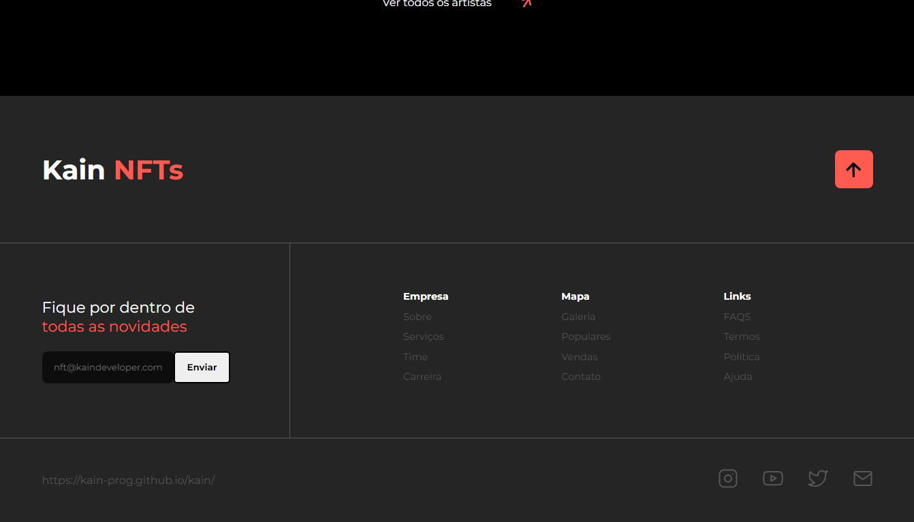

Challenge Concluded - 100% Responsive ✔ [NFT-RocketSeat]  

https://kain-prog.github.io/kain-nft

 

> Descrição:
Desafio NFT do Discover da Rocket Seat, desenvolvido pelo layout ja criado.

> Resultado do Portifólio finalizado.

O projeto foi criado em:

- [x] Criação do HTML
- [x] Criação do CSS
- [x] Criação do JavaScript

Resultado: https://kain-prog.github.io/kain-nft/

## 🤝 Colaboradores

Pessoa que contribuiu para este projeto:

<table>
  <tr>
    <td align="center">
      <a href="https://kain-prog.github.io/kain">
         
        
          <b>Matheus Santos [Kain Developer]</b>
        
      </a>
    </td>
   </tr>
</table>
